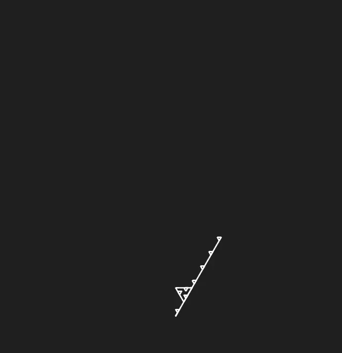
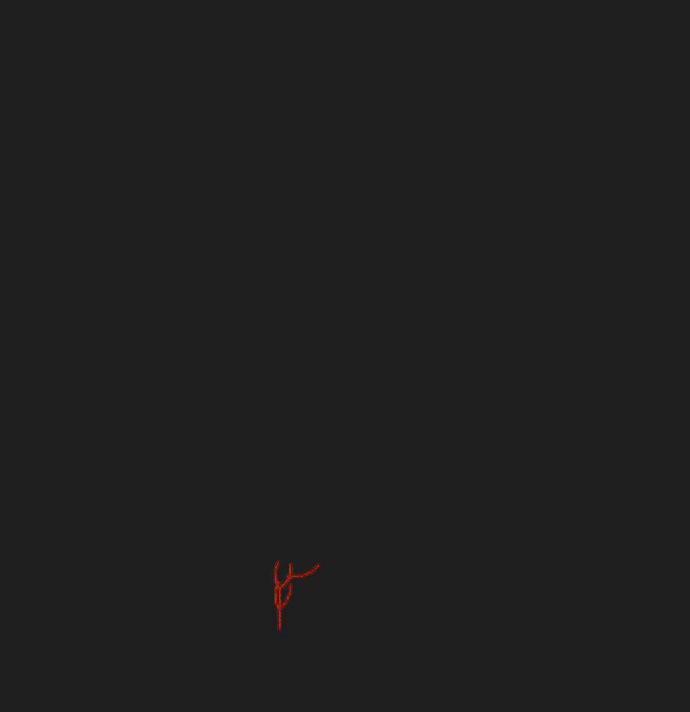

# 2D and 3D L-System Visualizer

This project generates and animates **2D and 3D L-systems** using **turtle graphics** and **matplotlib**, supporting both **deterministic** and **probabilistic** rule sets. It provides command-line access to visualize classic fractals and plant-like structures, with optional export of 3D rotation animations.

## Project Structure

- `main.py`: Entry point of the program. Parses CLI arguments and triggers either a 2D or 3D simulation.
- `l_system_2d.py`: Implements turtle logic for 2D systems, segment coloring, and animation using `matplotlib`.
- `l_system_3d.py`: Handles 3D turtle logic, probabilistic rule interpretation, rendering, and interactive rotation/animation.

## Features

### General
- Supports both **2D** and **3D** L-systems
- Command-line interface to select dimension and L-system
- Modular design with pluggable L-system definitions

### 2D L-System Features (`l_system_2d.py`)
- Interprets strings using classic **turtle graphics**
- Supports **custom step sizes**, **angles**, and **rotations**
- **Stack-based branching** using `[` and `]`
- Visualizes each drawing step as a line segment
- Optional **symbol-based coloring**
- Smooth **animated rendering** with `matplotlib`

### 3D L-System Features (`l_system_3d.py`)
- Full **3D turtle graphics** engine
- **Stack-based branching** using `[` and `]`
- **Yaw** and **pitch** rotation support (`+`, `-`, `&`, `^`)
- Optional **probabilistic rule sets**
- **Branch depth-based** rendering with color + linewidth variation
- Optional **Points** to add points to the render
- Interactive 3D plot with:
  - Mouse drag
  - `↑ / ↓` for elevation
  - `t` / `s` to save rotating animations (transparent or not)

## How to Run

### 1. Clone the repository to your local machine.

### 2. (Optional) Install dependencies
```bash
pip install -r requirements.txt
```

### 3. (Optional) See available L-systems
```bash
python main.py --list
```

### 4. Run an L-system

#### 2D Example
```bash
python main.py -d 2d fractal_triangle
```

#### 3D Example
```bash
python main.py -d 3d tree
```

> You can use `↑ / ↓` to rotate the 3D view, and press `s` or `t` to save animation frames.

## L-System Definition Template

Each L-system module should define the following:

### 2D L-System
```python
axiom = "F++F++F+++F--F--F"
rules = {"F": "FF++F++F++FFF"}
angle = 60
iterations = 3
step = 5
starting_rotation = 60  # optional
colors = {"F": "white"}  # optional
```

### 3D L-System
```python
axiom = "X[^X][&X]"
rules = {
    "X": [("F[+X][-X][^X][&X]", 0.7), ("F[+X][-X]", 0.3)],
    "F": [("FF", 0.9)]
}
iterations = 6
angle = 25
step = 1.3
main_color = "#8B4513"
point_color = "#228B22"
points = True
```

## Available Systems

### 2D Systems
- **Dragon Curve** (`dragon`)
- **Fractal Circle** (`fractal_circle`)
- **Fractal Triangle** (`fractal_triangle`)
- **Gosper Curve** (`gosper`)
- **Hilbert Curve** (`hilbert`)
- **Koch Snowflake** (`koch`)
- **Rectangles** (`rectangles`)
- **Seaweed** (`seaweed`)
- **Sierpinski Triangle** (`sierpinski`)
- **Small Tree** (`small_tree`)
- **Something** (`something`)
- **Something2** (`something2`)

### 3D Systems
- **Cube** (`cube`)
- **Plant** (`plant`)
- **Seaweed** (`seaweed`)
- **Tree** (`tree`)

## View All Available Systems
To view previews for all available systems, [click here](media/PREVIEWS.md).

## Example Outputs

### 2D

##### Fractal Triangle



##### Sierpinski Triangle



### 3D

##### Tree


##### Plant


##### Seaweed


## License

This project is licensed under the MIT License. See the [LICENSE](LICENSE) file for details.

## Acknowledgments

- L-system theory from **Aristid Lindenmayer**
- 3D interactivity powered by **matplotlib**
- Progress bars by **tqdm**
